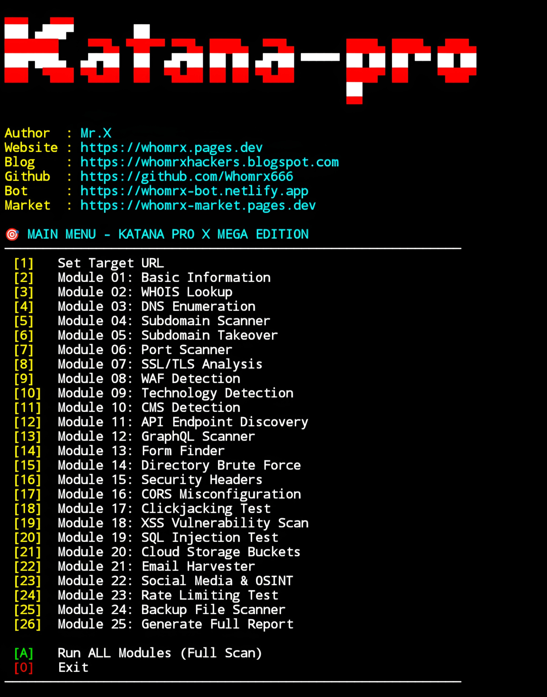

# Katana Pro


<p align="center">
  <strong>Ultimate Web Reconnaissance & Vulnerability Framework</strong><br>
  <em>"Know your enemy, know yourself"  Mr.X</em>
</p>

## Introduction
Katana Pro is an all-in-one cybersecurity framework built for web reconnaissance, vulnerability assessment, and OSINT gathering. With **25+ integrated modules**, it automates the entire recon workflow from basic domain intelligence to advanced vulnerability detection. Packaged in a sleek cyberpunk terminal interface, Katana Pro X runs smoothly on **Termux (Android)**, Linux, Windows, and Kali Linux **no root required**.

## Instalations
```bash
$ pkg update -y && pkg upgrade -y
$ pkg install git python -y
$ git clone https://github.com/Whomrx666/katana-pro.git
$ cd katana-pro
$ python3 install.py

```
## Run manually
```
$ python3 katana-pro.py
```


## Features
- **25+ Modules**   From basic recon to advanced vulnerability detection.
- **Termux Optimized**   Works flawlessly on Android.
- **Cyberpunk UI**   Neon colors and smooth animations.
- **Export Reports**   JSON, TXT, HTML formats.
- **OSINT Tools**   Email harvesting, social media discovery, cloud buckets.
- **Vulnerability Scans**   XSS, SQLi, CORS, Clickjacking, Subdomain Takeover.

## Modules Overview
| # | Module | Description |
|---|---------|-------------|
| 01 | Basic Information | Server headers, IP, status codes |
| 02 | WHOIS Lookup | Domain registration details |
| 03 | DNS Enumeration | All major DNS record types |
| 04 | Subdomain Scanner | Discover subdomains via wordlist |
| 05 | Subdomain Takeover | Detect dangling DNS vulnerabilities |
| 06 | Port Scanner | Scan common ports |
| 07 | SSL/TLS Analysis | Certificate info and validity |
| 08 | WAF Detection | Identify web application firewalls |
| 09 | Technology Detection | CMS, frameworks, server software |
| 10 | CMS Detection | WordPress, Joomla, Drupal, etc. |
| 11 | API Endpoint Discovery | REST, GraphQL, Swagger |
| 12 | GraphQL Scanner | Find endpoints + introspection |
| 13 | Form Finder | Extract HTML forms and inputs |
| 14 | Directory Brute Force | Common directories and sensitive paths |
| 15 | Security Headers Check | Missing security headers analysis |
| 16 | CORS Misconfiguration | Test CORS flaws |
| 17 | Clickjacking Test | X-Frame-Options protection |
| 18 | XSS Scan (Basic) | Reflected XSS detection |
| 19 | SQLi Test (Basic) | Error-based SQL injection |
| 20 | Cloud Storage Buckets | AWS S3, GCP, Azure buckets |
| 21 | Email Harvester | Extract emails from website |
| 22 | Social Media & OSINT | Discover linked social profiles |
| 23 | Rate Limiting Test | Check endpoint rate limiting |
| 24 | Backup File Scanner | Find exposed backup/config files |
| 25 | Full Report Generator | Export comprehensive scan results |

## Instructions
- **First**: Install the tool using the commands above.
- **Second**: Run `python3 katana-pro.py` after installation.
- **Third**: Set your target URL (e.g., `https://example.com`).
- **Fourth**: Choose individual modules or run `[A]` for a full scan.
- **Last**: After scanning, a detailed report will be displayed and can be exported.

## Observation
This tool is intended for **educational and ethical hacking purposes only**. Unauthorized scanning of systems you do not own or have explicit permission to test is illegal. The author assumes no responsibility for misuse or damage caused by this tool.

### Original Author
<a href="https://github.com/Whomrx666"></a>

### <<< If you copy , Then Give me The Credits >>>

## CONNECT WITH ME :

[](https://whomrxhackers.blogspot.com/)
[](https://twitter.com/whomrx666)
[](https://wa.me/6285926601133?text=Halo%2C%20Mr.X)
[](https://www.facebook.com/whomrx.666)
[](https://t.me/Whomr_X)
[](mailto:whomrx666@gmail.com)
[](https://www.tiktok.com/@whomr.x)

**If you want to donate, click on the button**
<a href="https://saweria.co/whomrx"></a>

---

<p align="left">
  
</p>